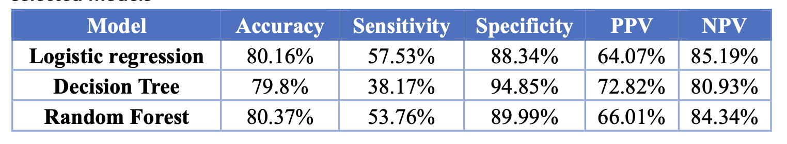

# Telco-Customer-Churn-Prediction
This project use Machine Learning techniques and R to predict customer churn in the company Telco. The research question is "How can we effectively predict customer churn by identifying and analyzing the key variables within a dataset, and how can this knowledge be utilized to assist businesses in modifying strategies for improving customer loyalty, retaining valuable customers and reducing churn rates?"
## Data limitation
- The dataset contains only 7011 observations, which can lead to overfitting and result in poor generalization of new data.
- The dataset imbalanced class distribution in our dataset (73.4% non-churn, 26.6% churn) which might lead to the prediction model tending to be biased towards the majority class.
- I split the dataset into train and test set using the stratified random sampling technique, a statistical method to create a sample that accurately reflects the population. We use the “createDataPartition” function from the caret package to perform stratified sampling based on the target variable (Churn).
- After the initial split, we use stratified cross-validation on the training subset to maintain the class balance within each fold, especially in imbalanced datasets.
- Missing data in these columns: "OnlineSecurity", "OnlineBackup", "DeviceProtection", "TechSupport", "StreamingTV", "StreamingMovies" (with value = 2). I replaced 2 = NA. I used MCAR test to assess whether the data in the dataset is missing completely at random. The result shows that the data is not missing at random (p-value = 0). Therefore, I employed logistic regression for imputation.
- I converted the categorical data to factors to ensure that the algorithm treats these variables appropriately.
## Packages use in this project
Tidyverse, Mice, Naniar, Visdat, Caret, GGplot2...
## Modelling 
### Logistic regression

### Decision Tree

### Random Forest

### Confusion Matrix

Among the three models, Logistic Regression demonstrated superior performance compared to the others. However, its reported accuracy of 80.03% can be misleading due to the imbalanced dataset. Despite having the highest sensitivity at 57.53% among the three models, it suggests that the model is overlooking a substantial portion of actual churn cases. Consequently, I tested the model with various cutoff thresholds, emphasizing our classifier's capacity to enhance accurate predictions.

### ROC Curve of Logistic Regression
The “optimal” threshold value is specified as 0.316, (0.760, 0.755) representing the corresponding coordinates on the ROC curve, typically denoting specificity, and sensitivity respectively. An AUC of 0.843 suggests a good discriminative ability of the model. At the value of 0.316, we see a corresponding sensitivity/true positive rate of 75.5%, and specificity rate of 76% (which also means the false positive rate equals to 24%).

## Findings
- The Logistic regression model suggests the key variables, namely "Contract2" (a two-year contract), "Contract1" (a one-year contract), "InternetService1" (DSL internet service), and "InternetService2" (Fiber Optic internet service), play crucial roles in the analysis. Both one-year and two-year contracts negatively correlate with customer churn, this suggests that longer-term commitments are linked to a lower likelihood of churn than shorter-term contracts. Conversely, Fiber Optic and DSL services exhibit a positive correlation, implying that subscribers to these services are more likely to churn compared to non-subscribers.
- The correlation between monthly charges, total charges, tenure, and customer churn implies that as monthly and total charges increase, customers are more likely to churn; however, customers with longer tenure are less likely to churn compared to those with shorter tenure.

## Recommendations
Based on our findings, we recommend Telco:
- Promote Long-Term Contracts: Offering incentives, discounts, or additional services for customers who commit to a longer-term contract.
- Evaluate Fiber Optic Service: Assessing the quality and satisfaction levels of these services. 
- Targeted Marketing and Communication: Utilizing the insights from the decile-wise lift charts to focus marketing and communication efforts on the top 30%-50% of predicted churn customers to save cost.
- Subscription Retention: encouraging subscription retention. This could also involve the introduction of loyalty programs and additional services.
- Customer Satisfaction and Loyalty Programs: Implementing regular customer satisfaction surveys to gather feedback, identify pain points, and understand needs. Leverage this data to make improvements, address issues contributing to churn, and reward long-term customers with exclusive benefits, discounts, or personalized offers, fostering loyalty and reducing the likelihood of switching to competitors.

